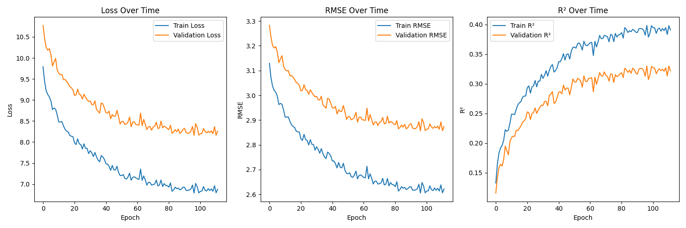

# Crop Yield Prediction Web App

This repository contains a Flask-based web application for predicting crop yields based on various factors such as crop type, state, season, and other agricultural data. The model used for prediction is a machine learning model that was trained using historical crop yield data. 

The application provides users with an interactive form where they can enter relevant information, and the model will predict the yield in metric tons per hectare.

## Features
- Predict crop yield based on various inputs such as crop name, state, season, year, rainfall, fertilizer usage, and pesticide usage.
- Optional inputs are supported (crop year, rainfall, fertilizer, and pesticide usage). If not provided, default values based on median values from the dataset are used.
- User-friendly form with error handling to ensure proper inputs are provided.
- Displays predicted crop yield in metric tons per hectare.

## Prerequisites

To run this project locally, you'll need to have Python 3.x installed. Additionally, you will need the following Python libraries:

- Flask
- NumPy
- Pandas
- scikit-learn
- joblib
- Bootstrap (for frontend styling)

  
## Training Progress



## Installation

Follow the steps below to get the project running on your local machine.

1. Clone this repository to your local machine:

   ```bash
   git clone https://github.com/your-username/crop-yield-prediction.git
   cd crop-yield-prediction
   ```

2. Create and activate a virtual environment (optional, but recommended):

   ```bash
   python3 -m venv venv
   source venv/bin/activate  # On Windows, use `venv\Scripts\activate`
   ```

3. Regenerate the model files and install requirements.txt:

   ```bash
   pip install requirements.txt
   python main.py
   ```

4. Ensure that you have the required model files:
   - `best_model.pkl`
   - `label_encoders.pkl`
   - `unique_values.pkl`
   - `median_values.pkl`

   These files can be obtained by training the model using the `old.py` script or from the project owner.

5. Run the Flask application:

   ```bash
   python app.py
   ```

6. Open your browser and go to `http://127.0.0.1:5000/` to use the application.

## File Structure

```
/crop-yield-prediction
│
├── app.py                     # Main Flask application
├── crop_yield.csv             # Dataset used for training the model (optional)
├── best_model.pkl             # Pretrained model used for predictions
├── label_encoders.pkl         # Label encoders used to encode categorical features
├── unique_values.pkl          # Unique values for crops, states, and seasons
├── median_values.pkl          # Median values for optional features
├── requirements.txt           # List of Python dependencies
├── /templates                 # HTML templates
│   ├── index.html             # Form for prediction
│   └── result.html            # Displays the prediction result
└── /static                    # Static files like CSS, JS (if used)
```

## Usage

1. Visit the main page and fill in the form with the following details:
   - **Crop Name** (Required)
   - **State Name** (Required)
   - **Season** (Required)
   - **Crop Year** (Optional)
   - **Annual Rainfall** (Optional)
   - **Fertilizer Use** (Optional)
   - **Pesticide Use** (Optional)

2. Click on **Predict Yield** to get the predicted crop yield.

3. The prediction will be displayed in metric tons per hectare.

## Model Details

The machine learning model used in this application is a **Gradient Boosting Regressor**, which was trained using historical crop yield data. The features used in the model include:
- Crop
- State
- Season
- Crop Year
- Annual Rainfall
- Fertilizer Usage
- Pesticide Usage

The model predicts the crop yield based on these features.

## Troubleshooting

If you encounter issues such as missing files or errors in prediction:
- Ensure that all required model files (`best_model.pkl`, `label_encoders.pkl`, `unique_values.pkl`, and `median_values.pkl`) are in place.
- Ensure that you are using the correct versions of the required libraries.

## Contributing

If you'd like to contribute to this project, feel free to fork the repository, create a branch, and submit a pull request with your changes.

## License

This project is licensed under the MIT License - see the [LICENSE](LICENSE) file for details.
